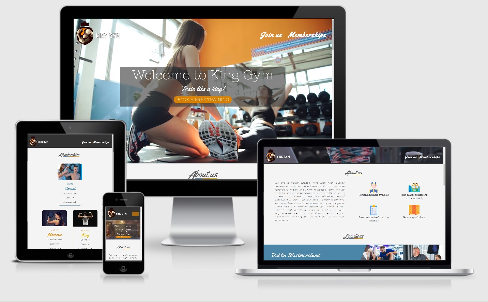

# King Gym

King Gym website is designed for current members and people looking to join a gym and wish to know more about the schedule, training available and all other information.

This is the first project in Code Institute Full Stack Developer program based on HTML, CSS and optional frameworks like Bootstrap.

## UX

### Main goals

- Design a website for a new gym in Dublin city center. Implement a simple and clear design that makes it easy to access all important information outlined in the user stories.
- Make the website responsive across all devices and browsers.
- Make the website seem welcoming to any person regardless of age and experience level.

### Research and design

> .

### User stories

1. As a potential **new** gym customer I want to easily find information on the following: locations, pricing, customer testimonials and contact details. Having an image gallery that showcases the look of the gym as well as the people that are attending is a plus. Idealy there would be an option to book a free training before having to commit.

2. As an **exisisting** gym user I want to get information such as working hours and gym class schedule.

### Wireframes

- [Homepage](assets/images/images_README/homepage.png)
- [Memberships](assets/images/images_README/memberships.png)
- [Signup](assets/images/images_README/signup.png)

### Fonts

> A script-type font Yellowtail was used for main headings which works well with the tricolor underline. The font differs from the one used in the frameworks since it was not available on Google Fonts. Nixie One was supposed to be the main paragraph font but it has limited weight options. It is still used for secondary text like forms. Montserrat was chosen as main paragraph font as it is more customisable and has a nice contrast with the main headings. 

### Colors

> I have decided to have three gym locations with different color themes. I have chosen a color pallete which worked well and was used across most pages.

<!-- ## Features -->

## Tehnologies used

##### Languages and frameworks

- HTML5
- CSS3
- Bootstrap

##### Tools

- [Github](https://www.gitpod.io/) - hosting platform for managing repositories and more
- [Gitpod](https://www.gitpod.io/) - coding enviroment
- [Git](https://git-scm.com/) - used for version control
- [Google Fonts](https://fonts.google.com/) - source of all fonts on the website
- [Adobe XD](https://www.adobe.com/ie/products/xd.html) - used for frameworks
- [Am I responsive](http://ami.responsivedesign.is/) - website look comparison above the project title
- [Color palletes](https://colorpalettes.net/) - inspiration from which the main pallete theme was taken
- [Ezgif](https://ezgif.com/) - Image resizing and optimisation
## Testing

### Responsiveness

> The website was designed for a laptop screen size first. Each section was then fully optimised for all screens before heading to the next one. I find it is easier to do it that way first and then just collapse the content for smaller screens. The page was viewed on different screen sizes along with using Chrome DevTools during creation. Minimum responsive width is 273px.

### Browser Compatibility

> Testing for desktop was done on Mozilla, Google Chrome and Microsoft Edge. No errors were present apart from the navigation links being visible when active on Mozilla. This was fixed by giving the active class to the actual link instead of the container making the website fully functional.

> Mobile testing was done on Safari, Samsung Internet and Google Chrome for mobile.   
### Code validation

> All HTML and CSS has been validated using the W3C validator with no errors.

### Accessibility

> Website was tested by WAVE accessibility assesment tool. There were no major issues apart from a few contrast errors. The colors were not changed since the backround of each location would have to be changed significantly to pass the WCAG standards. During testing it was shown that link and iframe tags do not have sufficient description of the content. This was fixed by adding aria-label and title attributes. Each image has alt text and semantic HTML was used when possible.

### Optimisation

- Images were converted to JPG to make the load time quicker.
- Meta discription tag was added for better SEO.

> Website was tested using Lighthouse in Chrome DevTools. It achieved a pretty good score of above 90 for each category. It was shown that certain images hinder the load time and they were resized which saved about 1.5 seconds loading time.
### Bugs

- Mobile toggler menu was glitching before loading due to the clash between bootstrap and element styles when activated. This was fixed by adding important to the viewport height property.
- Main headlines were not responsive when font size was changed in the browser settings. Fixed sizes were changed to ems which made everything scale proportionately. Putting the tricolor image inside the p tag allowed it to scale with the font size.
- Media breakpoint at 575px max-width only worked up to 574px. The 1px difference is possibly caused by Bootstrap media styles. The issue was fixed by changing max-width to 575.9px.

## Deployment 

## Credits

### Content

- All textual content was made up and written by me.

### Media

- All icons were taken from [Flaticon](https://www.flaticon.com/) under a commercial licence.
- All bigger media was taken from [Envato Elements](https://elements.envato.com/) under a commercial licence.
- Main page video is edited by me using different Envato videos and combining them with transitions.
### Aknowledgements

- My mentor Victor Miclovich for his unique insights.
- Code Institute staff and slack community which provided advice, project examples and the occasional motivational boost.
